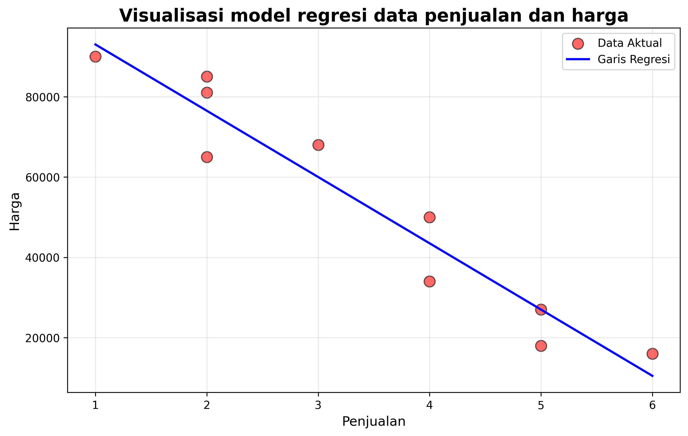
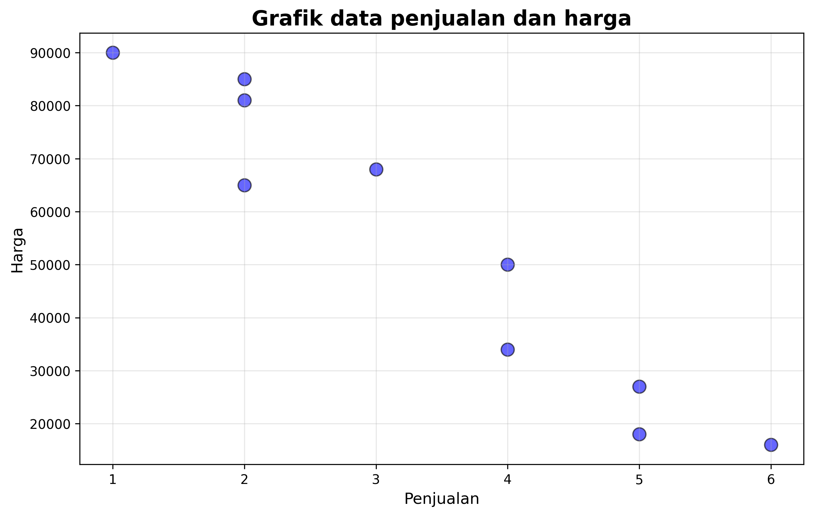
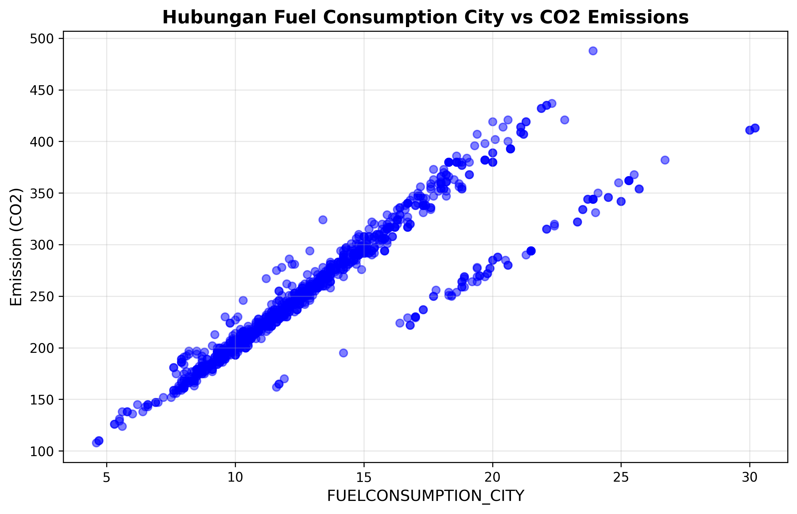
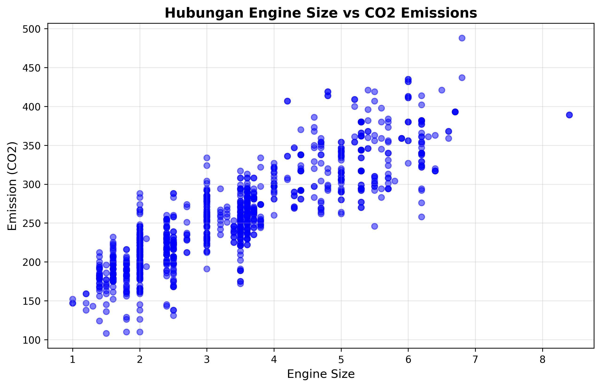
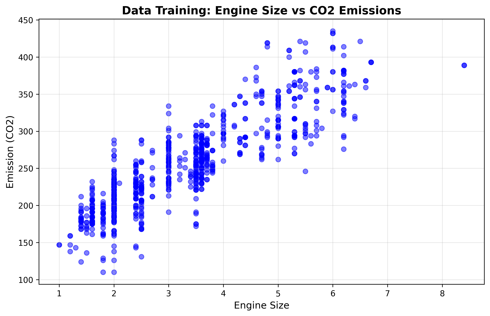
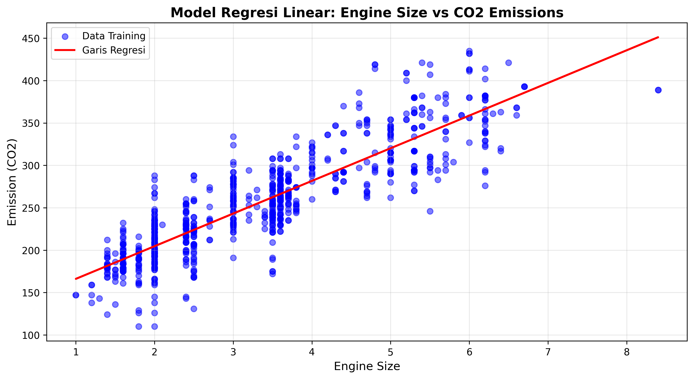
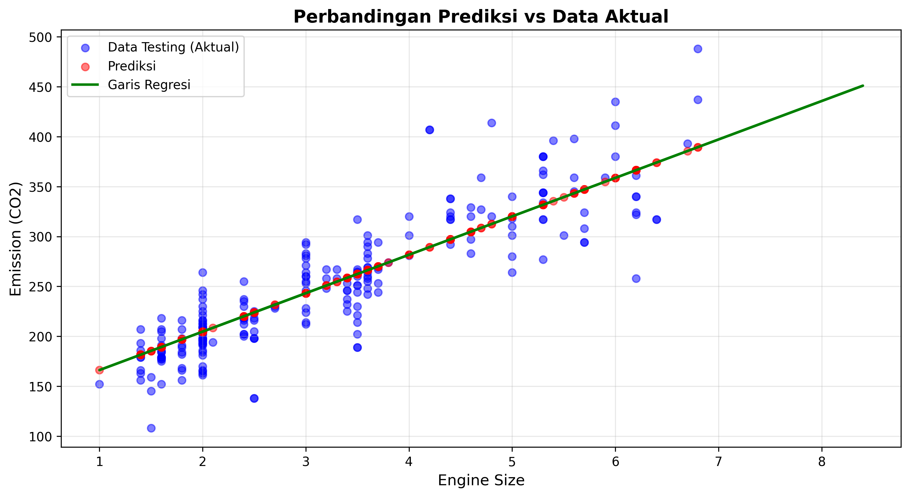

# 📊 Simple Linear Regression - Machine Learning

<p align="center">
  
</p>

Repository ini berisi implementasi **Simple Linear Regression** menggunakan Python untuk memprediksi nilai berdasarkan hubungan linear antara variabel independen dan dependen.

[](https://www.python.org/downloads/)
[](https://scikit-learn.org/)
[](LICENSE)

---

## 📋 Deskripsi Project

Project ini mengimplementasikan **dua modul pembelajaran** Simple Linear Regression:

| Modul | Deskripsi | Dataset |
|-------|-----------|---------|
| **Modul 1** | Konsep dasar regresi linear dengan data sembarang | Manual (Penjualan vs Harga) |
| **Modul 2** | Analisis mendalam dengan dataset real | Fuel Consumption CO2 |

---

## 🎯 Tujuan Pembelajaran

✅ Memahami konsep **Supervised Learning**  
✅ Mengimplementasikan **Simple Linear Regression**  
✅ Melakukan **visualisasi data** dan hasil prediksi  
✅ **Evaluasi performa model** menggunakan metrik yang sesuai  
✅ Memahami interpretasi **koefisien regresi**

---

## 📚 Materi Teori

### 🔹 Supervised Learning

**Supervised Learning** adalah pendekatan dalam machine learning yang menggunakan kumpulan data berlabel untuk melatih algoritma dalam mengklasifikasikan data atau memprediksi hasil secara akurat.

**Karakteristik:**
- Menggunakan data yang sudah memiliki label (input-output pairs)
- Model belajar dari data training untuk membuat prediksi
- Terbagi menjadi: **Regresi** dan **Klasifikasi**

### 🔹 Regresi Linear

**Regresi** adalah teknik machine learning untuk memprediksi nilai numerik yang bersifat kontinu. Berbeda dengan klasifikasi yang memprediksi kategori, regresi memprediksi nilai seperti harga, suhu, atau emisi CO2.

**Rumus Regresi Linear Sederhana:**
```
y = mx + c
```
Dimana:
- `y` = Variabel dependen (target)
- `x` = Variabel independen (fitur)
- `m` = Slope (kemiringan garis)
- `c` = Intercept (titik potong sumbu y)

---

## 🛠️ Teknologi yang Digunakan

| Library | Versi | Fungsi |
|---------|-------|--------|
| **Python** | 3.7+ | Bahasa pemrograman utama |
| **NumPy** | ≥1.21.0 | Perhitungan numerik dan array |
| **Matplotlib** | ≥3.4.0 | Visualisasi data dan grafik |
| **Pandas** | ≥1.3.0 | Manipulasi dan analisis data |
| **Scikit-learn** | ≥1.0.0 | Machine learning algorithms |

---

## 📦 Instalasi

### 1️⃣ Clone Repository
```bash
git clone https://github.com/username/simple-linear-regression.git
cd simple-linear-regression
```

### 2️⃣ Install Dependencies

**Opsi 1: Install menggunakan requirements.txt**
```bash
pip install -r requirements.txt
```

**Opsi 2: Install manual**
```bash
pip install numpy matplotlib scikit-learn pandas
```

**Opsi 3: Menggunakan Python module**
```bash
python -m pip install numpy matplotlib scikit-learn pandas
```

### 3️⃣ Download Dataset (untuk Modul 2)

**Otomatis:**
```bash
python download_dataset.py
```

**Manual:** Download dari [link ini](https://s3-api.us-geo.objectstorage.softlayer.net/cf-courses-data/CognitiveClass/ML0101ENv3/labs/FuelConsumptionCo2.csv) dan simpan sebagai `FuelConsumptionCo2.csv`

---

## 📂 Struktur Project
```
simple-linear-regression/
│
├── 📄 modul1_data_sembarang.py              # Implementasi regresi dengan data sembarang
├── 📄 modul2_dataset_fuel_consumption.py    # Implementasi regresi dengan dataset
├── 📄 download_dataset.py                   # Script download dataset otomatis
│
├── 📊 FuelConsumptionCo2.csv                # Dataset fuel consumption
├── 📋 requirements.txt                       # Dependencies
├── 📖 README.md                              # Dokumentasi (file ini)
│
└── 🖼️ Visualisasi Output:
    ├── visualisasi_data_scatter.png         # Scatter plot data penjualan-harga
    ├── visualisasi_model_regresi.png        # Model regresi modul 1
    ├── fuel_vs_emission.png                 # Fuel consumption vs CO2
    ├── engine_vs_emission.png               # Engine size vs CO2
    ├── training_engine_vs_emission.png      # Data training
    ├── model_regresi_linear.png             # Model regresi modul 2
    └── prediksi_vs_aktual.png               # Perbandingan prediksi vs aktual
```

---

## 🚀 Cara Menggunakan

### 📌 Modul 1: Data Sembarang (Penjualan vs Harga)
```bash
python modul1_data_sembarang.py
```

**Fitur Modul 1:**
- ✅ Membuat data penjualan dan harga secara manual
- ✅ Visualisasi scatter plot data
- ✅ Training model regresi linear
- ✅ Menampilkan persamaan regresi
- ✅ Prediksi untuk nilai baru

**Output:**

<p align="center">
  
  
</p>

**Contoh Output Console:**
```
Data Penjualan : [6 5 5 4 4 3 2 2 2 1]
Data Harga : [16000 18000 27000 34000 50000 68000 65000 81000 85000 90000]

=== Hasil Model Regresi ===
Coefficients (Slope): -14777.78
Intercept: 103333.33

Persamaan Regresi: y = -14777.78x + 103333.33

=== Prediksi Harga ===
Penjualan: 3.5, Harga Prediksi: Rp 51,611
Penjualan: 7.0, Harga Prediksi: Rp -893
```

---

### 📌 Modul 2: Dataset Fuel Consumption CO2

**Pastikan dataset sudah didownload terlebih dahulu!**
```bash
python modul2_dataset_fuel_consumption.py
```

**Fitur Modul 2:**
- ✅ Load dan eksplorasi dataset
- ✅ Analisis statistik deskriptif
- ✅ Visualisasi korelasi variabel
- ✅ Data splitting (80% training, 20% testing)
- ✅ Training model regresi linear
- ✅ Evaluasi model (MAE, MSE, R²)
- ✅ Visualisasi prediksi vs aktual

**Visualisasi Dataset:**

<p align="center">
  
  
</p>

**Model Training & Hasil:**

<p align="center">
  
  
</p>

**Evaluasi Model:**

<p align="center">
  
</p>

**Contoh Output Console:**
```
=== Informasi Dataset ===
<class 'pandas.core.frame.DataFrame'>
RangeIndex: 1067 entries, 0 to 1066
Data columns (total 4 columns):
 #   Column                   Non-Null Count  Dtype  
---  ------                   --------------  -----  
 0   ENGINESIZE              1067 non-null   float64
 1   CYLINDERS               1067 non-null   int64  
 2   FUELCONSUMPTION_CITY    1067 non-null   float64
 3   CO2EMISSIONS            1067 non-null   int64  

=== Data Splitting ===
Total data: 1067
Data training: 855
Data testing: 212

=== Koefisien Model Regresi ===
Coefficients:  [[39.32453336]]
Intercept:  [124.05671014]

Persamaan Regresi: CO2 = 39.32 * EngineSize + 124.06

=== Evaluasi Model ===
Mean Absolute Error (MAE): 23.45
Mean Squared Error (MSE): 892.67
R² Score: 0.7512

=== Prediksi CO2 Emissions untuk Engine Size Baru ===
Engine Size: 2.0, CO2 Emissions Prediksi: 202.71
Engine Size: 3.5, CO2 Emissions Prediksi: 261.69
Engine Size: 5.0, CO2 Emissions Prediksi: 320.68
```

---

## 📊 Analisis Hasil

### Interpretasi Koefisien

**Modul 1 (Penjualan vs Harga):**
- **Slope = -14777.78**: Setiap kenaikan 1 unit penjualan, harga **turun** Rp 14.777,78
- **Intercept = 103333.33**: Ketika penjualan = 0, harga = Rp 103.333,33
- **Hubungan negatif**: Semakin banyak penjualan, harga cenderung turun

**Modul 2 (Engine Size vs CO2 Emissions):**
- **Slope = 39.32**: Setiap kenaikan 1 liter engine size, CO2 emissions naik 39.32 g/km
- **Intercept = 124.06**: Engine size 0L menghasilkan emisi dasar 124.06 g/km
- **Hubungan positif**: Mesin lebih besar = emisi CO2 lebih tinggi

### Metrik Evaluasi

| Metrik | Penjelasan | Nilai Ideal |
|--------|-----------|-------------|
| **MAE** | Rata-rata error absolut | Mendekati 0 |
| **MSE** | Rata-rata kuadrat error | Mendekati 0 |
| **R² Score** | Proporsi varians yang dijelaskan model | Mendekati 1 (0-1) |

**Interpretasi R² = 0.7512:**
- Model dapat menjelaskan **75.12%** variasi CO2 emissions
- **24.88%** variasi dijelaskan oleh faktor lain
- Model cukup baik untuk prediksi

---

## 🔍 Penjelasan Kode Penting

### 1. Reshape Data untuk Scikit-learn
```python
penjualan_reshaped = penjualan.reshape(-1, 1)
```
**Kenapa perlu reshape?**
- Scikit-learn mengharapkan input 2D array (matrix)
- `-1` artinya "hitung otomatis jumlah baris"
- `1` artinya 1 kolom
- Mengubah `[1,2,3,4,5]` menjadi `[[1],[2],[3],[4],[5]]`

### 2. Training Model
```python
linreg = LinearRegression()
linreg.fit(penjualan_reshaped, harga)
```
**Proses:**
1. Inisialisasi model LinearRegression
2. `fit()` melatih model dengan data training
3. Model mencari garis terbaik yang meminimalkan error

### 3. Mendapatkan Koefisien
```python
print('Coefficients:', regr.coef_)
print('Intercept:', regr.intercept_)
```
- `coef_`: Nilai slope (m)
- `intercept_`: Nilai intercept (c)
- Membentuk persamaan: `y = coef_ * x + intercept_`

### 4. Data Splitting
```python
msk = np.random.rand(len(df)) < 0.8
train = cdf[msk]
test = cdf[~msk]
```
**Penjelasan:**
- Generate random number 0-1 untuk setiap baris
- Jika < 0.8 → masuk training (80%)
- Jika ≥ 0.8 → masuk testing (20%)
- `~msk` adalah negasi (kebalikan dari msk)

---

## 📈 Best Practices

### ✅ DO (Yang Harus Dilakukan)

1. **Visualisasi data sebelum modeling**
   - Cek distribusi data
   - Identifikasi outliers
   - Pahami hubungan antar variabel

2. **Split data menjadi training dan testing**
   - Hindari overfitting
   - Evaluasi performa model yang objektif

3. **Normalize/standardize data jika diperlukan**
   - Terutama jika range nilai sangat berbeda

4. **Evaluasi dengan multiple metrics**
   - Jangan hanya lihat satu metrik
   - MAE, MSE, R² memberikan informasi berbeda

### ❌ DON'T (Yang Harus Dihindari)

1. **Jangan langsung assume linear relationship**
   - Selalu visualisasi terlebih dahulu
   - Tidak semua data cocok untuk regresi linear

2. **Jangan gunakan semua data untuk training**
   - Sisakan data untuk testing
   - Validasi performa model

3. **Jangan abaikan outliers**
   - Outliers dapat mempengaruhi model
   - Analisis dan handle dengan tepat

---

## 🐛 Troubleshooting

### ❗ Error: ModuleNotFoundError
```bash
pip install numpy matplotlib scikit-learn pandas
```

### ❗ Error: FileNotFoundError (FuelConsumptionCo2.csv)
```bash
python download_dataset.py
```
Atau download manual dari link yang disediakan.

### ❗ Error: Execution Policy (PowerShell)
```bash
Set-ExecutionPolicy -ExecutionPolicy RemoteSigned -Scope CurrentUser
```

### ❗ Plot tidak muncul

Tambahkan `plt.show()` atau gunakan backend yang sesuai:
```python
import matplotlib
matplotlib.use('TkAgg')  # atau 'Qt5Agg'
```

---

## 🤝 Kontribusi

Kontribusi sangat diterima! Ikuti langkah berikut:

1. **Fork** repository ini
2. Buat **branch baru** (`git checkout -b feature/ImprovementBaru`)
3. **Commit** perubahan (`git commit -m 'Menambahkan fitur baru'`)
4. **Push** ke branch (`git push origin feature/ImprovementBaru`)
5. Buat **Pull Request**

**Ide Kontribusi:**
- Multiple Linear Regression
- Polynomial Regression
- Feature engineering
- Cross-validation
- Hyperparameter tuning
- Additional datasets

---

## 📖 Referensi & Resources

### 📚 Dokumentasi
- [Scikit-learn Linear Regression](https://scikit-learn.org/stable/modules/generated/sklearn.linear_model.LinearRegression.html)
- [NumPy Documentation](https://numpy.org/doc/)
- [Pandas Documentation](https://pandas.pydata.org/docs/)
- [Matplotlib Gallery](https://matplotlib.org/stable/gallery/index.html)

### 🎓 Tutorial & Course
- [IBM Machine Learning Course](https://github.com/Ilham-Fauzi02/Regresi-Linier-Sederhana-ID-)
- [Supervised Learning - IBM](https://www.ibm.com/topics/supervised-learning)
- [Machine Learning Crash Course - Google](https://developers.google.com/machine-learning/crash-course)

### 📊 Dataset Source
- [Fuel Consumption Dataset](https://s3-api.us-geo.objectstorage.softlayer.net/cf-courses-data/CognitiveClass/ML0101ENv3/labs/FuelConsumptionCo2.csv)

---

## 📄 Lisensi

Project ini menggunakan lisensi **MIT**. Lihat file [LICENSE](LICENSE) untuk detail lebih lanjut.
```
MIT License

Copyright (c) 2024 [Nama Anda]

Permission is hereby granted, free of charge, to any person obtaining a copy
of this software and associated documentation files...
```

---

## 👤 Author

**[Nama Anda]**

- 🌐 GitHub: [@username](https://github.com/username)
- 📧 Email: email@example.com
- 💼 LinkedIn: [Your Profile](https://linkedin.com/in/username)

---

## 🙏 Acknowledgments

- 🎓 Terima kasih kepada **IBM** untuk dataset Fuel Consumption CO2
- 🛠️ Terima kasih kepada komunitas **Scikit-learn** dan **Python**
- 📚 Materi pembelajaran dari mata kuliah **Pembelajaran Mesin**
- 👨‍🏫 Bimbingan dari dosen pengampu

---

## 📌 Catatan Penting

> **Catatan untuk Mahasiswa:**
> - Pastikan memahami konsep dasar regresi linear sebelum implementasi
> - Jangan hanya copy-paste code, pahami setiap baris
> - Eksperimen dengan dataset lain untuk pemahaman lebih dalam
> - Dokumentasikan setiap percobaan dan hasil yang didapat

> **Tips Sukses:**
> - Mulai dari yang sederhana (Modul 1) baru ke yang kompleks (Modul 2)
> - Selalu visualisasi data Anda
> - Jangan takut untuk bereksperimen
> - Baca error message dengan teliti

---

<p align="center">
  <b>⭐ Jika repository ini bermanfaat, jangan lupa berikan star! ⭐</b>
</p>

<p align="center">
  <i>Made with ❤️ for Machine Learning Learning</i>
</p>

---

**Last Updated:** 30 Maret 2024  
**Version:** 1.0.0
